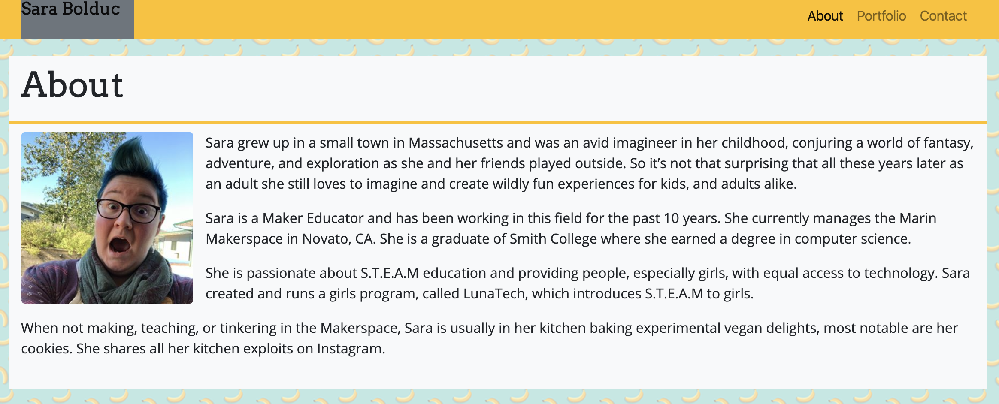

# Bootstrap-Portfolio
My basic portfolio created using Bootstrap

## Built With
* [Bootstrap](https://getbootstrap.com/) - responsive framework for web
* [Google Fonts](https://fonts.google.com/) - open source typography catalog

## Versioning & Author
This is the only version and is maintained by me, [sabomade](https://github.com/sabomade).

## Acknowledgements
Built & completed as part of the UCB Coding Bootcamp, Homework 2: Responsiveness
